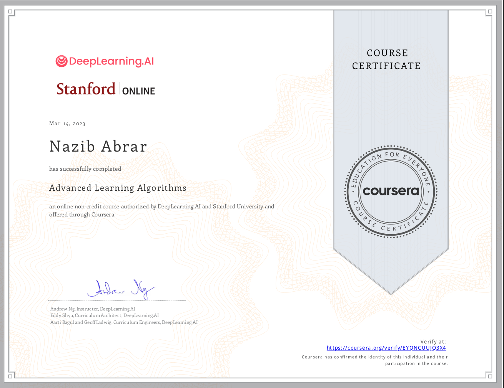
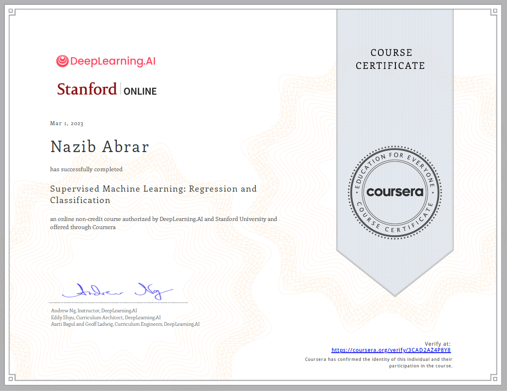
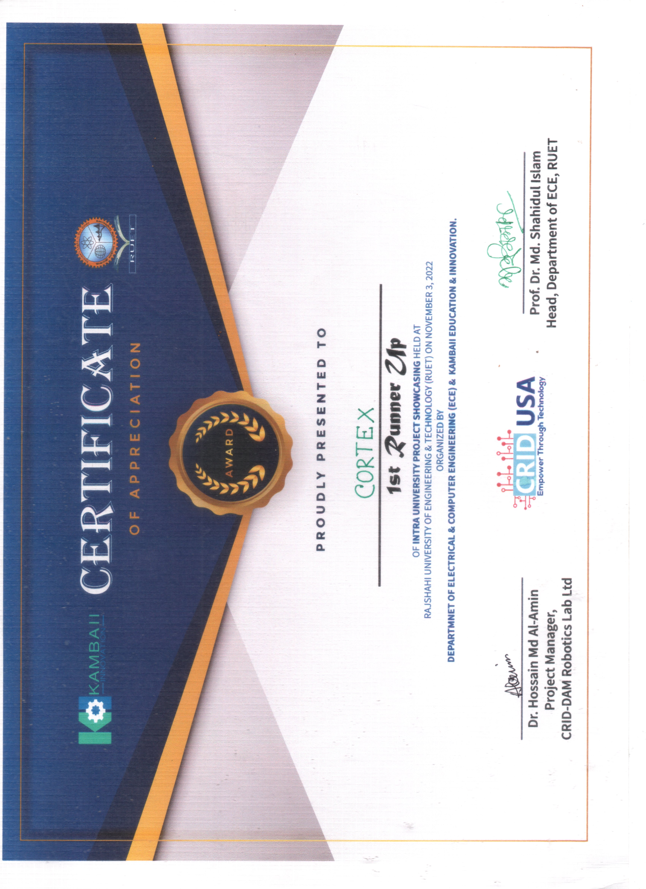
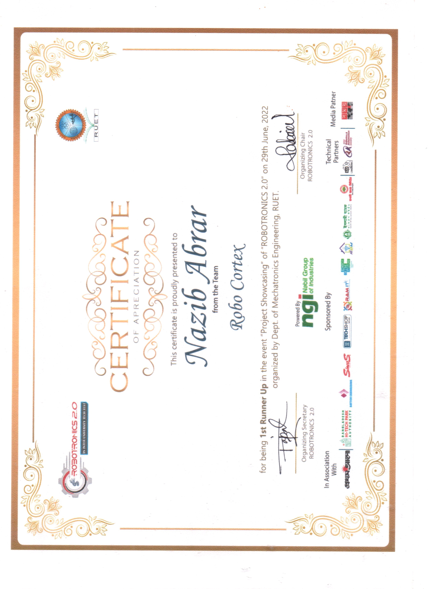
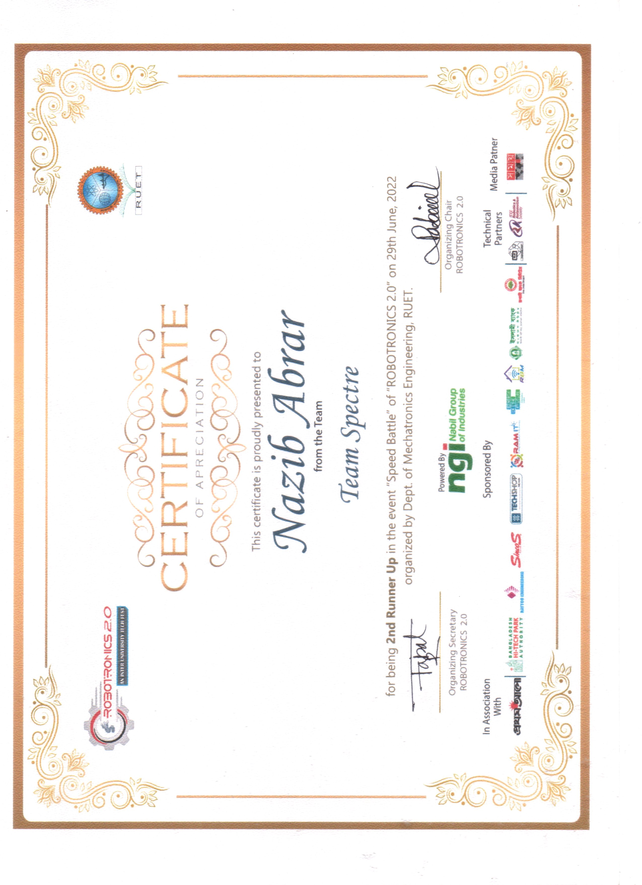
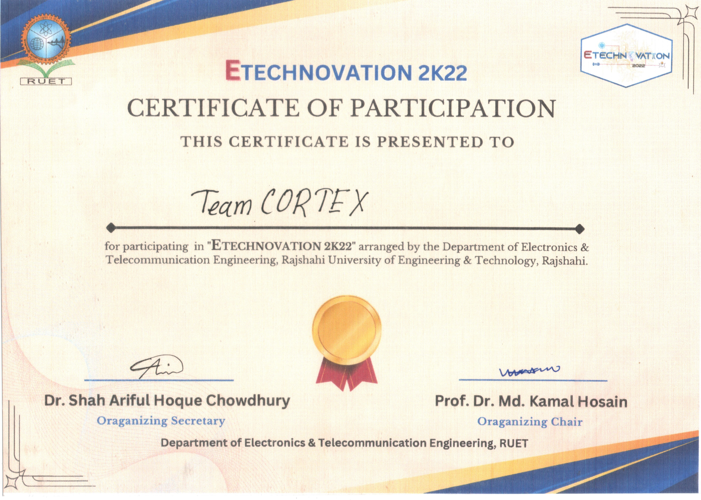
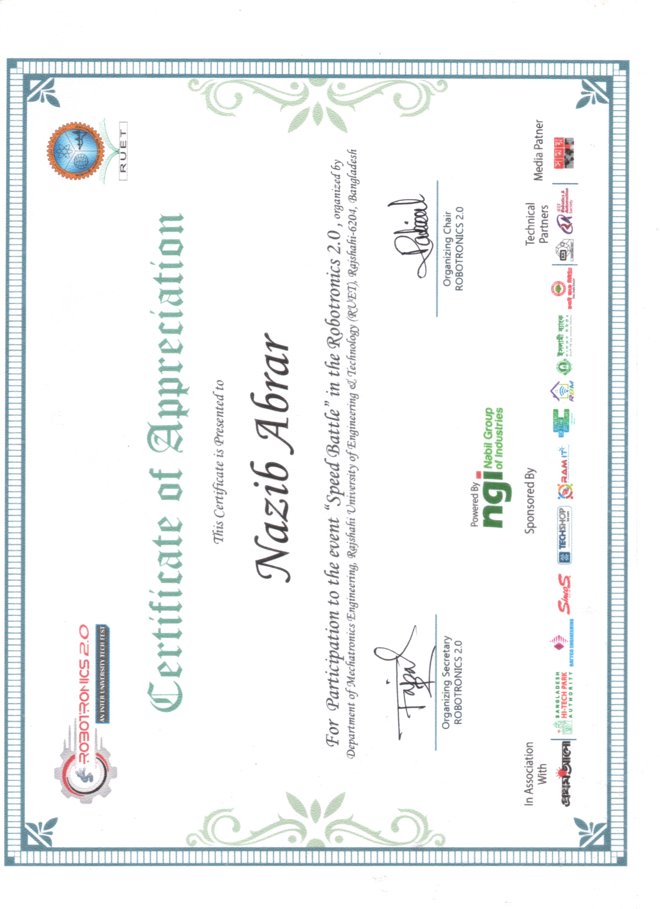
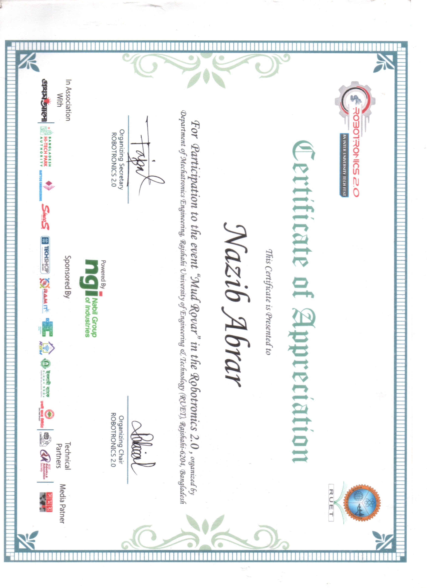

# CERTIFICATES

This repository is a gallery where I store the digital copy of all of my certificates.

## **Courses**

### **Advanced Learning Algorithms**

|                 |                                       |
| --------------- | ------------------------------------- |
| **Issuer:**     | Stanford University & Deeplearning.ai |
| **Platform:**   | Coursera                              |
| **Score:**      | 100%                                  |
| **Issue Date:** | 14 March, 2023                        |

### **Supervised Machine Learning: Regression & Classification**

|                 |                                       |
| --------------- | ------------------------------------- |
| **Issuer:**     | Stanford University & Deeplearning.ai |
| **Platform:**   | Coursera                              |
| **Score:**      | 100%                                  |
| **Issue Date:** | 01 March, 2023                        |

### **Data Visualization**

|                 |                                       |
| --------------- | ------------------------------------- |
| **Issuer:**     | Kaggle |
| **Platform:**   | Kaggle                              |
| **Issue Date:** | 05 September, 2023                        |

---

---

---

## **Awards**

---

---

### **Intra University Project Showcasing Competition, RUET. Organized by ECE Department**

|                 |                                |
| --------------- | ------------------------------ |
| **Event:**      | Project Showcasing Competition |
| **Position:**   | First Runner Up                |
| **Issue Date:** | 03 November, 2022              |

---

### **Robotronics 2.0, RUET. Organized by MTE Department, RUET**

|                 |                                |
| --------------- | ------------------------------ |
| **Event:**      | Project Showcasing Competition |
| **Position:**   | First Runner Up                |
| **Issue Date:** | 02 July, 2022                  |

---

|                 |                                                |
| --------------- | ---------------------------------------------- |
| **Event:**      | Line Follower Robot Competition (Speed Battle) |
| **Position:**   | Second Runner Up                               |
| **Issue Date:** | 02 July, 2022                                  |

---

---

---

---

## **Participation Certificates**

---

---

### **ETEchnovation, RUET. Organized by ETE Department, RUET**

|                 |                                |
| --------------- | ------------------------------ |
| **Event:**      | Project Showcasing Competition |
| **Issue Date:** | 02 December, 2022              |

---

|                 |                                 |
| --------------- | ------------------------------- |
| **Event:**      | Line Follower Robot Competition |
| **Issue Date:** | 02 December, 2022               |

---

### **Robotronics 2.0, RUET. Organized by MTE Department, RUET**

|                 |                                                |
| --------------- | ---------------------------------------------- |
| **Event:**      | Line Follower Robot Competition (Speed Battle) |
| **Issue Date:** | 02 July, 2022                                  |

---

|                 |                                |
| --------------- | ------------------------------ |
| **Event:**      | Project Showcasing Competition |
| **Issue Date:** | 02 July, 2022                  |

---

|                 |                  |
| --------------- | ---------------- |
| **Event:**      | Mud Rover Racing |
| **Issue Date:** | 02 July, 2022    |

---
